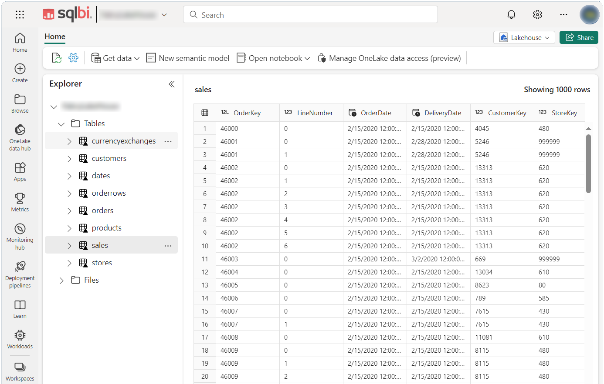

# Contoso Data Generator V2


DataGenerator is a tool for generating sample data, ready to be imported into PowerBI or Fabric OneLake for analysis. This is the V2 version, evolution of the [older one](https://github.com/sql-bi/Contoso-Data-Generator).

If you are just interested in **ready to use sets of data** , [download them here.](https://github.com/sql-bi/Contoso-Data-Generator-V2-Data)

Supported output formats:
 - Parquet
 - Delta Table (files)
 - CSV
 - CSV multi file
 - CSV multi file - gz compressed
 - Sql Server, via bulk insert script of the generated CSV files


Delta Table output can be directly used in Fabric LakeHouse without any conversion:

<br/><br/>

Data schema:

|  |  |
| -- | -- |
|  |   |


## Usage overview

<br/> 

**FULL DOCUMENTATION** available here: **[&#x21D2; &#x21D2; https://docs.sqlbi.com/contoso-data-generator/ &#x21D0; &#x21D0;](https://docs.sqlbi.com/contoso-data-generator/)**

<br/> 

DataGenerator requires four mandatory elements to run:
 - a configuration file (json)
 - a data file (excel)
 - an output folder
 - a cache folder
 - [optional parameters]

```
databasegenerator.exe  configfile  datafile  outputfolder  cachefolder   [param:AAAAA=nnnn] [param:BBBBB=mmmm]
```
Example:

```
databasegenerator.exe  c:\temp\config.json  c:\temp\data.xlsx  c:\temp\OUT\  c:\temp\CACHE\
```

**Note**: the tool needs some files containing static data: fake customers, exchange rates, postal codes, etc. The files are cached after been downloaded over the Internet from a specific SQLBI repository.
 
 <br/>
 <br/>
 <br/>