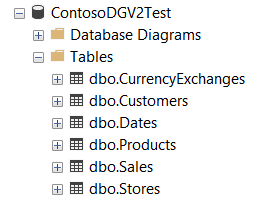

## Import to SQL Server

### Scripts for importing data into SQL Server

The set of scripts under `scripts/sql` allow to import CSV output files to a Sql Server database. The scripts create the required tables, indexes and relationship and import data using sql bulk insert. The underlying SQL scripts are executed using SQLCMD from the command line.

Steps:
 - Create the data, as CSV files, using your custom options or using the scripts under `scripts/dataset` (see "Usage") .
 - Copy the output files under `scripts/sql/inputcsv` 
 - Adapt the script to your SQL server instance. SQLCMD requires sql server name and other parameters to connect to you sql server. The script default is: 
 `sqlcmd -S (LocalDb)\MSSQLLocalDB -d ContosoDGV2Test`
 - Run the import script that fit you needs:
    - `SqlDBSales.cmd` : import base tables + sales
    - `SqlDBOrders.cmd` : import base tables + orders/rows
    - `SqlDBAll.cmd` : import base tables + sales + orders/rows


Resulting database:




### Bulk insert from Azure Storage Account

In some scenarios it is useful to import data into SQL Azure / SQL Server directly from an Azure Storage Account. BULK INSERT can get data directly from Blob Storage[^1].

If required, create a master encryption key[^2]:

```SQL
CREATE MASTER KEY ENCRYPTION BY PASSWORD = '<strong_password>';
SELECT * FROM sys.symmetric_keys;
```

Create a database scoped credential for accessing the storage account. The SAS_TOKEN requires at lest Read and List permissions:

```SQL
CREATE DATABASE SCOPED CREDENTIAL CDGV2TestSAS 
    WITH IDENTITY = 'SHARED ACCESS SIGNATURE',
    SECRET = '...SAS_TOKEN...';
SELECT * FROM sys.database_scoped_credentials;
```

Declare an external datasource, pointing it to your storage account, using the credential created in the previous step (Important: no '/' at the end of the location URL):

```SQL
CREATE EXTERNAL DATA SOURCE CDGV2Storage
WITH (
    TYPE = BLOB_STORAGE,
    LOCATION = 'https://xxxxxxxxxxxxxxxxx.blob.core.windows.net',
    CREDENTIAL = CDGV2TestSAS
);
```

Now, you can bulk-import the data:

```SQL
BULK INSERT [Customers] FROM 'mycontainer/csv-100k/customers.csv' WITH (DATA_SOURCE='CDGV2Storage', TABLOCK, FORMAT='CSV', FIRSTROW=2, FIELDTERMINATOR =',');
BULK INSERT [Products]  FROM 'mycontainer/csv-100k/products.csv'  WITH (DATA_SOURCE='CDGV2Storage', TABLOCK, FORMAT='CSV', FIRSTROW=2, FIELDTERMINATOR =',');
BULK INSERT [Sales]     FROM 'mycontainer/csv-100k/sales.csv'     WITH (DATA_SOURCE='CDGV2Storage', TABLOCK, FORMAT='CSV', FIRSTROW=2, FIELDTERMINATOR =',');
...
```


[^1]: https://learn.microsoft.com/en-us/sql/relational-databases/import-export/examples-of-bulk-access-to-data-in-azure-blob-storage

[^2]: https://learn.microsoft.com/it-it/sql/t-sql/statements/create-master-key-transact-sql

