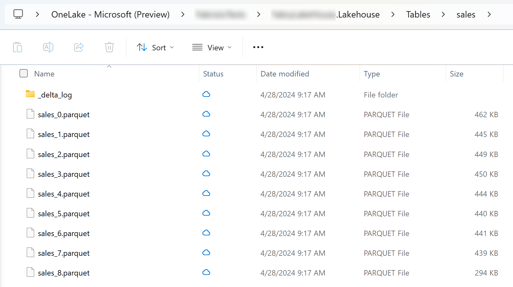
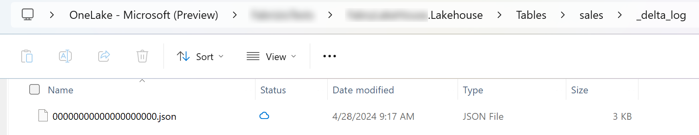
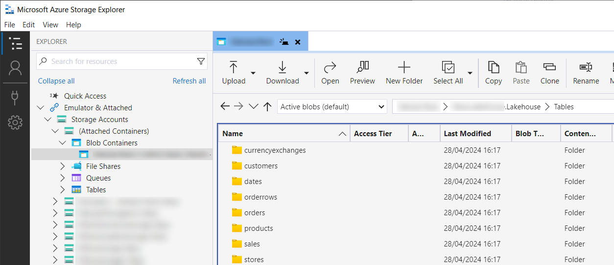
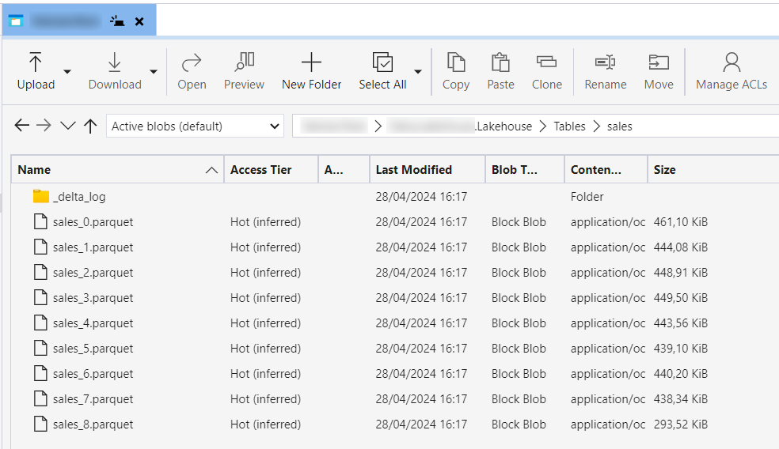
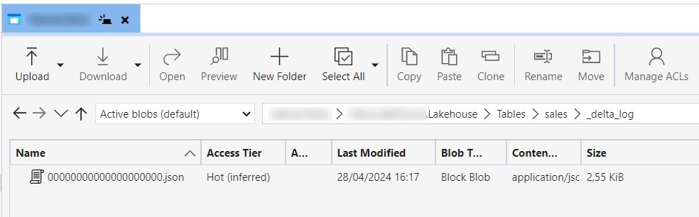

# Upload data to Fabric LakeHouse


Delta Table output files generated by the tool can be easily and directly uploaded to Fabric LakeHouse without any conversions. Just copy all the files, respecting the folders structures, directly under "Tables" LakeHouse folder, and data will be ready to use.

<br/><br/>


There are 3 ways to upload files to LakeHouse directly:
 - OneLake File Explorer (Windows only)
 - Azure Storage Explorer
 - AzCopy from the command line

## OneLake File Explorer

Currently in preview. It integrates with Windows File Explorer and allows you to manage files on Fabric with a OneDrive-like user-experience. Details here: https://learn.microsoft.com/en-us/fabric/onelake/onelake-file-explorer

Data generated by the tool, uploaded to LakeHouse:  

<br/><br/>
<br/><br/>
<br/><br/>

## Azure Storage Explorer

Details here: https://learn.microsoft.com/en-us/fabric/onelake/onelake-azure-storage-explorer

Data generated by the tool, uploaded to LakeHouse:  

<br/><br/>
<br/><br/>
<br/><br/>


## AzCopy

First of all, login with AzCopy:

```
azcopy login
```

To test connectivity, try to list the files on the storage Tables partition:

```
azcopy list  https://onelake.blob.fabric.microsoft.com/<WORKSPACE-NAME>/<LAKEHOUSE-NAME>.Lakehouse/Tables  --trusted-microsoft-suffixes onelake.blob.fabric.microsoft.com
```

Upload all file:

```
azcopy copy "../out/*"  https://onelake.blob.fabric.microsoft.com/<WORKSPACE-NAME>/<LAKEHOUSE-NAME>.Lakehouse/Tables  --recursive --check-length --put-md5 --trusted-microsoft-suffixes onelake.blob.fabric.microsoft.com
```

It also possible to delete all existing files. **Be very careful!**
Import: for some unknown reasons, the command often fails. Retry many times till all files have been deleted successfully.

```
azcopy remove  https://onelake.blob.fabric.microsoft.com/<WORKSPACE-NAME>/<LAKEHOUSE-NAME>.Lakehouse/Tables/*  --recursive=true  --trusted-microsoft-suffixes onelake.blob.fabric.microsoft.com
```